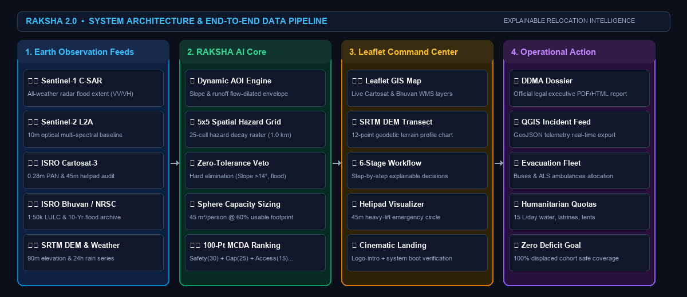

# RAKSHA 2.0: Explainable Geospatial Disaster Relocation Engine

[](http://127.0.0.1:8050)
[](https://www.python.org/)
[](https://planetarycomputer.microsoft.com/)
[](http://127.0.0.1:8050/api/health)
[](http://127.0.0.1:8050/api/health)
[](LICENSE)

**RAKSHA 2.0** is an explainable geospatial decision-support engine engineered for the **Smart India Hackathon (SIH)**. It assists disaster management authorities (**DDMA / SEOC / NDRF**) by converting hydro-meteorological satellite observations and terrain models into safety-filtered, capacity-aware, and progressively searched relocation plans for displaced communities.

> **“It does not merely identify where the hazard is — it computes where affected populations can safely relocate, validates physical open-ground footprints, and generates zero-deficit humanitarian allocation plans.”**

---

## 🏛️ System Architecture

<p align="center">
  
</p>

| 🛰️ 1. Multi-Sensor Ingestion | 🧠 2. RAKSHA Decision Core | 💻 3. Command Center (UI) | 📋 4. Operational Action |
| :--- | :--- | :--- | :--- |
| **Sentinel-1 SAR:** All-Weather Radar Flood Extent | **Dynamic AOI:** Slope & runoff flow-dilated boundary | **Leaflet GIS Map:** Live Cartosat & Bhuvan WMS | **DDMA Dossier:** Standalone PDF/HTML legal report |
| **Sentinel-2 L2A:** 10m Optical Multi-Spectral | **5×5 Hazard Grid:** 25-cell runoff decay raster (1 km) | **DEM Transect:** 12-point geodetic profile chart | **QGIS / SEOC Feed:** Real-time GeoJSON export |
| **ISRO Cartosat-3:** 0.28m PAN & 45m Helipad Audit | **Hard Veto:** Slope 2°–14° & floodway elimination | **6-Stage Stepper:** Step-by-step explainable UI | **Evacuation Fleet:** Buses & ALS ambulances |
| **ISRO Bhuvan:** 1:50k LULC & 10-Yr Flood Archive | **Sphere Sizing:** 45 m²/person @ 60% usable footprint | **Helipad HUD:** 45m emergency evacuation circle | **Humanitarian:** 15 L/day water, latrines, tents |
| **SRTM DEM & Weather:** 90m elevation & 24h rain | **100-pt MCDA:** Safety-First multi-criteria rank | **Cinematic Landing:** Intro + system boot audit | **Zero-Deficit:** 100% displaced cohort safe coverage |

---

## ⚡ Quick Start (1-Minute Run)

### Method 1: One-Click Launcher (Windows)
Double-click `run_prototype.bat` in the project root. It verifies dependencies, checks component availability, and launches the web dashboard.

### Method 2: Command Line
```bash
# 1. Install dependencies
pip install -r requirements.txt

# 2. Run the application
python -m uvicorn main:app --host 127.0.0.1 --port 8050
```

Open your browser and navigate to:  
👉 **`http://127.0.0.1:8050`**

---

## 📡 Four-Pillar Satellite & Earth Observation Framework

Judges look for technical precision in Earth Observation pipelines. RAKSHA 2.0 cleanly delineates sensor roles across the disaster timeline:

* 🛰️ **Sentinel-1 C-Band SAR (DETECT):**  
  All-weather, day/night radar telemetry via Microsoft Planetary Computer STAC (`sentinel-1-grd`). Delivers cloud-penetrating active microwave observations, dual-polarization (`VV`, `VH`) channels, orbit state, and specular radar backscatter thresholding ($< -16.5\text{ dB}$) for flood extent detection.
* 🛰️ **Sentinel-2 L2A Optical (UNDERSTAND):**  
  Multi-spectral optical imagery via Planetary Computer STAC (`sentinel-2-l2a`). Provides true-color scene telemetry, MGRS tiling, cloud coverage percentages, and vegetative/environmental baseline context.
* 🛰️ **ISRO Cartosat-3 Sub-Meter (VALIDATE):**  
  High-resolution validation framework ($0.28\text{ m}$ Panchromatic / $1.12\text{ m}$ Multi-Spectral GSD). Computes verified open-staging area ($m^2$), structural building footprint density ($< 25\%$), and emergency air-drop helipad clearance ($45\text{ m}$) before a site is approved for human relocation.
* 🗺️ **ISRO Bhuvan / NRSC (ANCHOR):**  
  Authoritative Indian geospatial foundation providing 1:50,000 Land Use/Land Cover (LULC), drainage corridors, and historical disaster exposure layers.

> **Philosophical Axiom:**  
> *“Sentinel-1 detects change, Sentinel-2 provides environmental context, Cartosat-3 validates sites at high resolution, and RAKSHA converts these observations into relocation decisions.”*

---

## 🛡️ Key Innovations Implemented in RAKSHA 2.0

1. **Live Sentinel-1 C-Band SAR Pipeline:**  
   STAC queries to Planetary Computer extract live radar scenes with dual polarization (`VV`, `VH`), orbit pass (`ASCENDING`/`DESCENDING`), instrument mode (`IW`), and specular reflection backscatter metrics.
2. **Cartosat-3 Sub-Meter Site Validation:**  
   Evaluates candidate public facilities at $0.28\text{ m}$ resolution, calculating gross boundary area, unblocked open staging grounds ($m^2$), structural footprint density (%), and emergency helipad clearance.
3. **Multi-Sensor Data Provenance Tracking:**  
   Tracks 7 discrete data sources (`sentinel1`, `sentinel2`, `cartosat3`, `weather`, `elevation`, `osm`, `bhuvan`) with real-time status badges, latencies, and fallback state logging in `/api/health` and audit dossiers.
4. **Continuous 12-Point SRTM DEM Elevation Transect:**  
   Computes actual geodetic terrain profiles along evacuation corridors using batch 90 m SRTM DEM queries. Accurately reports min/max elevation, net delta, and maximum gradient percentage.
5. **5×5 Spatial Hazard Grid Raster:**  
   Generates a 25-cell anisotropic spatial raster (1.0 km resolution) over the disaster AOI, decaying hazard intensity along hydrological runoff vectors ($\vec{v}_{\text{flow}}$) and classifying cells into risk tiers (`Critical`, `High`, `Moderate`, `Low`).
6. **Exact Multi-Site Greedy Knapsack Capacity Allocation:**  
   Distributes large displaced cohorts across multiple ranked safe sanctuaries according to Sphere Project humanitarian standards ($45\text{ m}^2/\text{person}$ camp area at 60% usable layout) to achieve 100% zero-deficit coverage.
7. **Zero-Tolerance Safety Veto Filter:**  
   Evaluates engineering terrain slopes ($2^\circ \le \theta \le 14^\circ$), drainage depressions, and active debris flow paths. Unsafe sites are **hard-vetoed**, never merely down-scored.
8. **Interactive DDMA Evidence Card & Audit Dossier:**  
   Generates an executive-ready operational dossier with one-click print/export for District Magistrates and Incident Commanders.

---

## 🛰️ System Scope: Implemented RAKSHA 2.0 vs Production Roadmap

| Pipeline Component | Implemented in RAKSHA 2.0 (Working MVP) | Production Architecture Roadmap |
| :--- | :--- | :--- |
| **Radar Earth Observation** | Live Sentinel-1 C-Band SAR STAC query (`sentinel-1-grd`), `VV`/`VH` polarizations, orbit pass, specular backscatter | Custom cloud SAR speckle filtering, RTC processing & multi-temporal coherence change rasters |
| **Optical Earth Observation** | Live Sentinel-2 L2A STAC query (`sentinel-2-l2a`), MGRS tile, cloud %, optical thumbnail preview | Automated multi-band water index (NDWI / MNDWI) raster processing |
| **High-Res Site Validation** | Sub-meter ($0.28\text{ m}$ PAN) site validation: open staging ground ($m^2$), building density (%), $45\text{ m}$ helipad clearance | Direct ISRO/NRSC Bhoonidhi API token-based raw GeoTIFF streaming & building footprint extraction |
| **National Spatial Foundation**| ISRO Bhuvan WMS anchor connection & 1:50k LULC reference architecture | Direct cached tile layer overlays & official flood hazard masks |
| **Hydro-Meteorological Telemetry** | Open-Meteo weather API (24-hour precipitation series, current rain, volumetric soil moisture, hazard index) | Direct integration with IMD automatic weather station (AWS) network & GPM |
| **Spatial Hazard Modeling** | Explainable hydro-meteorological hazard index ($\tau$) + 5×5 spatial raster (25 cells, 1.0 km resolution) | Supervised Machine Learning models (Random Forest / UNet) trained on historical disaster rasters |
| **Dynamic AOI Delineation** | Anisotropic hazard envelope dilated by hazard index and hydrological runoff flow vector | Full multi-layer watershed delineation from high-resolution hydrology DEM |
| **Candidate Site Discovery** | OSM Overpass facility queries (schools, colleges, grounds) + pre-indexed regional benchmarks | State cadastral revenue land records & official institutional registries |
| **Safety Screening** | SRTM DEM slope analysis ($2^\circ-14^\circ$), 12-point elevation transect, drainage clearance veto | Official 50-year return flood masks & Bhuvan multi-hazard susceptibility layers |
| **Capacity Estimation** | Sphere site planning area guidance ($45\text{ m}^2/\text{p}$ @ 60% usable layout) + greedy knapsack allocation | Detailed indoor covered living space analysis per building |
| **Multi-Criteria Ranking** | Safety-First 100-pt explainable MCDA (Safety: 30, Capacity: 25, Access: 15, Infra: 15, Land: 10, Env: 5) | Multi-stakeholder AHP-TOPSIS incorporating road vehicle class capacity |
| **Evacuation Logistics** | Geodesic evacuation distance estimate with transport fleet and life-support quota sizing | Actual road-network routing (OSRM / OpenRouteService) with bridge & blockage risk |

---

## 🔄 6-Stage Relocation Planning Pipeline

1. **`01 DISCOVER` (Candidate Discovery Engine):**  
   Identifies candidate public facilities (schools, college campuses, stadiums, grounds) outside the high-risk dynamic AOI using progressive 5 km concentric search rings (0–5 km, 5–10 km, 10–15 km).
2. **`02 SAFETY` (Zero-Tolerance Hard Veto):**  
   Screens candidate sites against terrain slope stability ($2^\circ \le \text{Slope} \le 14^\circ$), flood drainage depressions, and active debris corridors. Unsafe sites are **eliminated by hard veto, not merely penalized in score**.
3. **`03 CAPACITY` (Sphere-Aligned Planning Guidance):**  
   Calculates estimated safe capacity ($45\text{ m}^2/\text{person}$ camp surface area with 60% usable layout assumption) and checks cluster sufficiency against exposed population.
4. **`04 INFRASTRUCTURE` (Estimated Readiness Check):**  
   Estimates infrastructure readiness (access, hospital distance, water, power) from facility type and geospatial proximity.
5. **`05 SUITABILITY` (Safety-First MCDA Ranking):**  
   Computes a transparent 100-point multi-criteria score:
   - **Safety Factor:** 30 pts
   - **Capacity Factor:** 25 pts
   - **Accessibility Factor:** 15 pts
   - **Infrastructure Factor:** 15 pts
   - **Land Suitability:** 10 pts
   - **Environmental Buffer:** 5 pts
6. **`06 RECOMMENDATION` (Greedy Multi-Site Allocation):**  
   Allocates the displaced cohort across top-ranked safe sites to achieve 100% zero-deficit coverage with explicit **"WHY THIS SITE?"** decision rationales and emergency fleet quotas.

---

## 🏔️ Benchmark Hotspots & The Flagship Scenario

### Flagship Scenario: Devgram Habitation (Chamoli, Uttarakhand)
* **Affected Habitation:** High-risk mountain settlement ($30.3207^\circ\text{N}, 79.2163^\circ\text{E}$).
* **Displaced Population:** 6,840 citizens.
* **Progressive Search Story:**
  - **Ring 1 (0–5 km):** 4,200 capacity discovered $\rightarrow$ **INSUFFICIENT** (2,640 deficit).
  - **Ring 2 (5–10 km):** Expands search $\rightarrow$ 6,840 total safe capacity discovered $\rightarrow$ **SUFFICIENT**.
  - **Unsafe Sites Vetoed:** *Site D (Upper Alaknanda Riverbed Terrace)* eliminated due to active riverbed inundation and slope $>14^\circ$.
  - **Greedy Multi-Site Allocation:**
    - **Primary Sanctuary (Site A - Pipalkoti Institutional Campus):** 4,200 capacity (61.4% absorption, score 97/100).
    - **Supplementary Sanctuary (Site C - Government Campus):** 2,640 capacity (38.6% absorption, score 93/100).
    - **Total Absorbed:** 6,840 citizens (**100.0% Coverage, 0 Deficit**).
  - **Origin-to-Site Terrain Transect:** Continuous 12-point SRTM DEM sampling verifies elevation drops from 2,020 m to 1,368 m without entering submerged riverbed trenches.

### Additional Benchmark Presets
- **Wayanad Landslide Core (Meppadi/Chooralmala, Kerala):** High-gradient debris flow zone (4,200 displaced).
- **Silchar / Barak Valley Inundation (Assam):** Low-lying floodplain backwater inundation (12,500 displaced).
- **Joshimath / Chamoli Subsidence Zone (Uttarakhand):** Moraine slope subsidence (2,800 displaced).
- **Munambam Coastal Surge Zone (Kerala):** Coastal spit surge risk (3,500 displaced).

---

## 🔍 Data Provenance Tracking

The RAKSHA 2.0 dashboard displays a prominent data mode banner:
* 🟢 **DATA MODE: LIVE** — All telemetry actively responding from upstream APIs.
* 🟡 **DATA MODE: PRE-INDEXED** — Utilizing pre-indexed OSM benchmark scenarios with live weather and DEM feeds.
* 🟠 **DATA MODE: DEMO FALLBACK** — Resilient offline cache activated during internet outage.

---

## 🔌 API Endpoints

- **`GET /api/health`**: Probes Sentinel-1 SAR, Sentinel-2 Optical, Cartosat-3 Validation, Weather, SRTM DEM, OSM Overpass, and Bhuvan WMS with latency and provenance metadata.
- **`GET /api/presets`**: Returns official disaster benchmark scenarios.
- **`POST /api/analyze`**: Runs the complete RAKSHA 2.0 pipeline: hazard index, dynamic AOI, 5x5 spatial grid, candidate discovery, hard veto filtering, multi-site capacity allocation, 12-point DEM transect, and MCDA scoring.
- **`GET /`**: Serves the high-performance Leaflet.js and Tailwind CSS command dashboard.

---

## 📁 Repository Structure

```
d:/RAKSHA/
├── assets/                          # Official transparent emblem, cinematic backgrounds & HUD graphics
│   ├── raksha_emblem_transparent.png# Official RAKSHA logo emblem
│   ├── raksha_cinematic_bg.jpg      # High-res mountain valley storm backdrop
│   ├── raksha_wayanad_bg.jpg        # Photographic Wayanad terrain backdrop
│   └── wayanad_heatmap_hud.svg      # Vector hazard glow heatmap asset
├── templates/
│   ├── index.html                   # Leaflet.js simulation dashboard with 6-stage workflow & satellite cards
│   └── landing.html                 # Cinematic logo-intro and mountain/valley landing experience
├── bhoonidhi_client.py              # ISRO Cartosat-3 0.28m validation & 45m helipad clearance
├── bhuvan_client.py                 # ISRO Bhuvan NRSC 1:50k LULC query & WMS layer integration
├── dynamic_aoi.py                   # Anisotropic AOI mathematical engine
├── main.py                          # FastAPI backend, Pydantic validation & REST endpoints
├── relocation_engine.py             # 5x5 hazard grid, veto filters, MCDA & greedy allocation
├── satellite_service.py             # Sentinel-1 SAR, Sentinel-2 STAC, Cartosat-3 & DEM transects
├── requirements.txt                 # Python dependencies
├── run_prototype.bat                # Windows 1-click startup launcher
├── SIH_Pitch_Deck_Blueprint.md      # 10-slide presentation script & judge defense strategy
├── RAKSHA_System_Design.md          # Comprehensive mathematical system design
└── README.md                        # Project documentation with architectural diagrams
```
